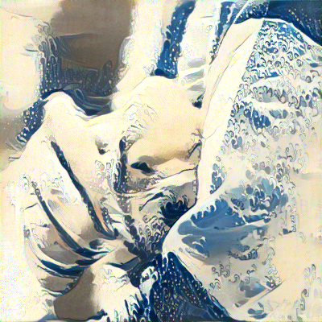

# Pytorch-Style-transfer

Uma implementação da técnica Style Transfers utilizando o Framwork Pytorch.

Implementação baseada no artigo: https://www.cv-foundation.org/openaccess/content_cvpr_2016/papers/Gatys_Image_Style_Transfer_CVPR_2016_paper.pdf

  
  
  

## Detalhes da implementação
Não foi criado um modelo. Ou seja, não há um agente que recebendo uma imagem, em pouco tempo irá transformar o estilo dela.

Nesta implementação é criada uma *imagem alvo* (TI - Target Image) que pode ser qualquer coisa, mas normalmente é uma cópia da *imagem do conteúdo* (CI - Content Image).0

A técnica funciona combinando o conteúdo da CI com o estilo de uma *imagem de estilo* (SI - Style Image). Para fazer essa mescla, o artigo utiliza a rede rede pré-treinada VGG-19 para encontrar as informações de estilo da SI e o conteúdo da CI, pois em camadas específicas da rede são encontradas informações do estilo (cores, bordas, etc.) e em uma específica o conteúdo da imagem é totalmente isolado. Entenda por conteúdo, o foco da imagem. No caso de um foto sua, você seria o conteúdo. Já no caso de uma imagem de uma árvore, ela seria o conteúdo.

Com o conteúdo e e o estilo em mãos, calculamos a distância entre os pixels de TI e os de CI e SI. O erro do estilo é calculado separadamente do erro do conteúdo. Para calcular os erros é utilizada a métrica MSE (Mean Squared Error) para a diferença entre o conteúdo de TI e o conteúdo de CI. Já para o estilo, é usado MSE, entre as matrizes de GRAM de TI e SI e esse resultado é multiplicado por um peso. Os erros são somados e com isso é calculado o gradiente para atualizar os pixels da TI.

Implementação realizada durante o curso Deep Learning Nanodegree.
